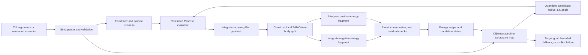
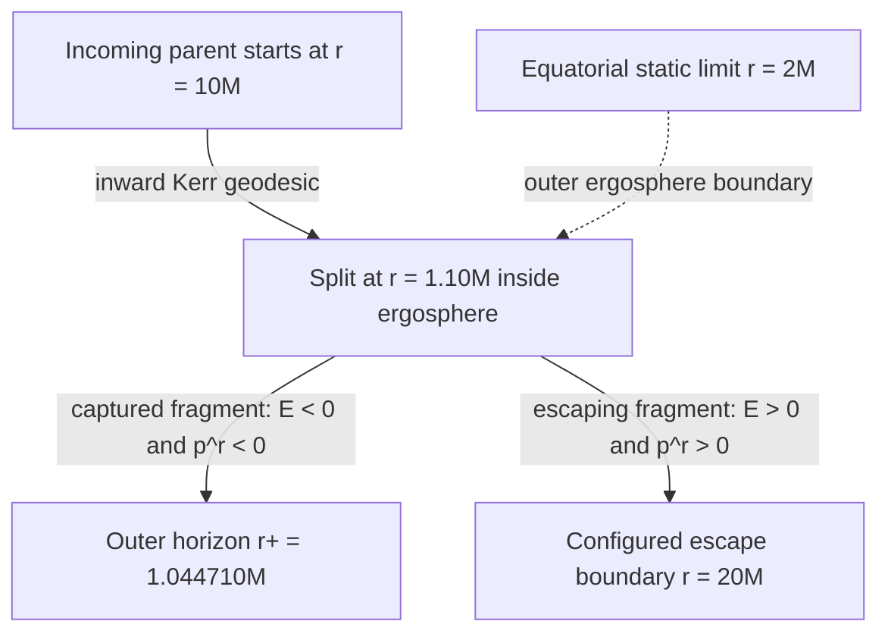
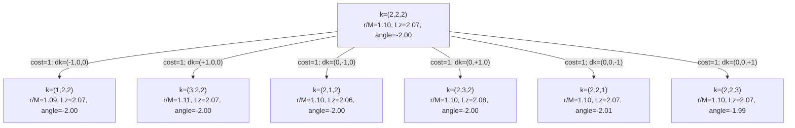
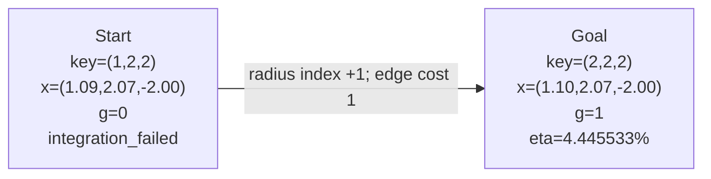

# Black Hole Energy Simulation

A deterministic C++20 scientific-computing engine for Kerr rotational-energy
estimation, adaptive equatorial geodesic integration, constrained Penrose-event
validation, and graph search over candidate split parameters.

This project combines three engineering problems:

- **computational physics:** Kerr geometry, conserved quantities, radial
  potentials, local orthonormal frames, and event detection;
- **algorithm design:** a bounded three-dimensional parameter graph searched
  with deterministic Dijkstra and checked independently with exhaustive maps;
- **C++ systems work:** explicit value types, strict parsing, cancellation,
  compact search-state caching, reproducible ordering, testing, and installable
  CMake targets.

The current engine is a restricted, scalar research baseline. It does **not**
claim that energy has been extracted from an observed black hole, that the
result can be delivered to Earth, or that its educational plasma estimate is a
GRMHD simulation.

## Contents

- [Project status](#project-status)
- [Quick start](#quick-start)
- [Architecture](#architecture)
- [Computational physics](#computational-physics)
- [Penrose event model](#penrose-event-model)
- [Graph model and Dijkstra search](#graph-model-and-dijkstra-search)
- [Reproducible results](#reproducible-results)
- [C++ engineering](#c-engineering)
- [Performance engineering](#performance-engineering)
- [CLI and scenarios](#cli-and-scenarios)
- [Validation](#validation)
- [Limitations and roadmap](#limitations-and-roadmap)
- [References](#references)

## Project status

The repository is intentionally explicit about what is implemented and what is
still planned.

| Capability | Status | Current contract |
| --- | --- | --- |
| Kerr rotational-energy reservoir | Implemented and tested | SI mass input, sub-extremal spin, sensitivity, and ordered uncertainty bounds |
| Schwarzschild trajectory solver | Implemented reference | Fixed-step RK4 for equatorial timelike validation cases |
| Kerr trajectory solver | Implemented restricted model | Adaptive equatorial Boyer-Lindquist geodesics with `Q = 0` |
| Penrose split evaluator | Implemented restricted model | Neutral, equal-mass two-body split in a local ZAMO frame |
| Dijkstra parameter search | Implemented and tested | Three quantized variables, six local neighbors, unit edge costs, deterministic ties |
| Bounded phase-space map | Implemented and tested | Exhaustive scan and greatest validated extraction within the declared grid |
| Below-target fallback | Implemented and tested | Greatest validated extraction after a complete failed threshold search; extraction ties minimize `g` |
| Scenario parsing | Implemented and tested | Versioned `key = value` files with strict required-key and duplicate-key checks |
| Toy plasma transport | Educational baseline | Transparent 0-D ideal-MHD-inspired scaling, explicitly not GRMHD |
| Multithreaded compute backend | Planned | No thread pool or parallel speedup claim exists yet |
| SIMD numerical kernels | Planned | No AVX/SSE implementation or SIMD speedup claim exists yet |
| Benchmark harness and profiler counters | Planned | Current timings are single observed runs, not benchmark distributions |
| Catalogue, isotope data, Python binding, demand comparison | Planned | Not present in the current repository |
| Full Kerr, charged particles, MHD/GRMHD | Planned research stages | Not represented by the current lower-fidelity models |

For a recruiter or reviewer, the implemented work demonstrates numerical
modeling, graph algorithms, deterministic software design, scientific
validation, and CMake packaging. Multithreading and SIMD are documented below
as concrete next stages, not as completed resume claims.

## Quick start

### Requirements

- CMake 3.20 or newer;
- a C++20 compiler;
- Ninja, Make, or a Visual Studio generator.

### Configure, build, and test

Single-configuration generator, such as Ninja:

```powershell
cmake -S . -B build -DCMAKE_BUILD_TYPE=Release
cmake --build build
ctest --test-dir build --output-on-failure
```

Visual Studio or another multi-configuration generator:

```powershell
cmake -S . -B build
cmake --build build --config Release
ctest --test-dir build -C Release --output-on-failure
```

Run the declared 15% target search with a bounded fallback:

```powershell
.\build\black_hole_demo.exe --search-penrose .\scenarios\equatorial_penrose_dijkstra_15_percent.cfg
```

The current expanded scenario does not reach 15%. It evaluates the complete
2,375-node graph and returns the best validated below-target candidate with an
explicit `best_feasible_below_target` status.

## Architecture

The optimization layer never replaces the physics layer. Dijkstra proposes a
candidate parameter set; the Penrose evaluator determines whether that node is
physically meaningful under the restricted model.



The source tree keeps these responsibilities separate:

| Area | Primary files | Responsibility |
| --- | --- | --- |
| Algebraic physics | `src/physics/algebraic_model.cpp` | Mass-energy, irreducible mass, rotational reservoir, uncertainty bounds |
| Geometry and integration | `src/integrators/kerr_geodesic.cpp` | Kerr geometry, radial potential, adaptive RK4, event localization |
| Reference integration | `src/integrators/schwarzschild_geodesic.cpp` | Independent zero-spin RK4 validation baseline |
| Penrose event | `src/physics/penrose_model.cpp` | ZAMO transform, local split, conserved quantities, capture and escape checks |
| Graph optimization | `src/optimization/dijkstra.cpp` | Grid construction, priority queue, deterministic traversal, fallback selection |
| Scenario I/O | `src/io/penrose_scenario_io.cpp` | Versioned parsing through `std::from_chars` and structured errors |
| CLI | `src/app/main.cpp` | Commands, interactive session, and auditable diagnostics |
| Public API | `include/bh/` | Value types and installable library interface |
| Validation | `tests/` | Unit, CLI, malformed-input, and downstream-package tests |

## Computational physics

### Units and conventions

The algebraic reservoir accepts SI mass in kilograms and returns joules. The
relativistic trajectory engine uses geometrized units:

```text
G = c = 1
metric signature = (-,+,+,+)
coordinates = Boyer-Lindquist (t, r, theta, phi)
current restriction = theta = pi/2 and Carter constant Q = 0
```

The search uses normalized coordinates such as `r/M` and `Lz/(mM)`. A search
run fixes the black-hole mass, spin, particle model, tolerances, and escape
radius; it varies only three dimensionless split parameters.

### Algebraic Kerr reservoir

For SI mass `M` and dimensionless spin `a_star`, the irreducible mass fraction
is

```text
f_irr(a_star) = sqrt((1 + sqrt(1 - a_star^2)) / 2)
M_irr         = M * f_irr
E_mass        = M * c^2
E_rot         = (M - M_irr) * c^2
```

`E_rot` is the theoretical rotational-energy reservoir of the black hole. It is
not the energy automatically extracted by one Penrose event. As `a_star`
approaches one, the ideal reservoir fraction approaches
`1 - 1/sqrt(2)`, approximately 29.29% of total mass-energy.

The implementation evaluates `1 - a_star^2` as
`(1 - a_star)(1 + a_star)` to reduce cancellation near extremality. It also
reports the local spin sensitivity implemented by

```text
dE_rot/da_star = M*c^2 * a_star
                 / (4 * sqrt(1 - a_star^2) * f_irr(a_star))
```

Ordered mass and spin ranges produce lower, central, and upper reservoir
values. These are deterministic bounds, not confidence intervals unless the
caller gives the input bounds that statistical meaning.

### Kerr horizons and ergosphere

Let `a = a_star * M` be the Kerr spin length. Define

```text
Delta(r) = r^2 - 2*M*r + a^2
Sigma(r, theta) = r^2 + a^2*cos(theta)^2

r_plus  = M + sqrt(M^2 - a^2)
r_minus = M - sqrt(M^2 - a^2)

r_static(theta) = M + sqrt(M^2 - a^2*cos(theta)^2)
```

At the equator, `Sigma = r^2` and `r_static = 2M`. The ergosphere is the open
region between the outer event horizon and the outer static limit:

```text
r_plus < r < r_static
```

The event horizon and ergosphere are different boundaries. A Penrose split
must occur inside the ergosphere, the captured fragment must cross the horizon,
and the escaping fragment must separately reach a configured large radius.



The diagram shows a **physical spacetime event**. It is distinct from the
parameter-adjustment graph shown later.

### Equatorial radial dynamics

For conserved energy `E`, axial angular momentum `Lz`, rest-mass parameter
`mu`, and `Q = 0`, the code evaluates

```text
P(r) = E*(r^2 + a^2) - a*Lz

R(r) = P(r)^2
       - Delta(r) * (mu^2*r^2 + (Lz - a*E)^2)
```

The geodesic is radially allowed only where `R(r) >= 0`. On the selected inward
or outward branch,

```text
Sigma * dr/dlambda = +/- sqrt(R)

Sigma * dt/dlambda = a*(Lz - a*E)
                     + (r^2 + a^2)*P/Delta

Sigma * dphi/dlambda = (Lz - a*E) + a*P/Delta
```

This gives the engine concrete event logic:

- `R < 0`: forbidden radial region;
- `R = 0`: radial turning point;
- inward motion reaching `r_plus*(1 + 10^-6)`: horizon-crossing event;
- outward motion reaching `escape_radius`: escape event;
- non-positive `dt/dlambda`: rejected as not future-directed.

The normalized radial first-integral residual is monitored along every accepted
trajectory:

```text
epsilon_R = abs((Sigma*dr/dlambda)^2 - R)
            / max(1, abs((Sigma*dr/dlambda)^2), abs(R))
```

### Adaptive RK4 integration

The Kerr solver compares one full RK4 step with two half steps. For radius and
azimuth, the estimated fourth-order local error is divided by `2^4 - 1 = 15`.
A step is accepted only when the largest normalized component error is at most
one. Accepted and rejected step counts, maximum normalized error, final step
size, and maximum radial residual are returned with each trajectory.

Turning points are localized by sampling for the first forbidden radial band
and then bisecting the first `R(r) = 0` boundary. Horizon, target-radius, and
escape-radius events are also localized rather than accepted only at an
overshooting RK4 endpoint.

Boyer-Lindquist coordinate time is reported but omitted from adaptive error
control because it becomes coordinate-singular at the horizon. This does not
remove the physical horizon event; it avoids allowing a coordinate singularity
to dominate the numerical step controller.

## Penrose event model

### Local ZAMO frame

The split is constructed in a local orthonormal frame associated with a
zero-angular-momentum observer (ZAMO). At the equator the implementation uses

```text
A          = (r^2 + a^2)^2 - a^2*Delta
g_phiphi   = A/r^2
alpha      = r*sqrt(Delta)/sqrt(A)
omega      = 2*M*a*r/A

p^(t_hat)   = alpha * p^t
p^(r_hat)   = r/sqrt(Delta) * p^r
p^(phi_hat) = sqrt(g_phiphi) * (p^phi - omega*p^t)
```

`alpha` is the lapse and `omega` is the local frame-dragging angular velocity.
The local frame turns the split into a Minkowski-space conservation problem at
one event, while the coordinate transform connects each fragment back to Kerr
conserved quantities.

### Two-body split construction

Let `u_parent` be the normalized parent four-velocity. The code builds radial
and azimuthal unit basis vectors orthogonal to `u_parent`, then uses the declared
split angle `theta_split`:

```text
n = cos(theta_split)*e_r + sin(theta_split)*e_phi

E_daughter_COM = m_parent/2
p_daughter_COM = sqrt(E_daughter_COM^2 - m_fragment^2)

p_1 = E_daughter_COM*u_parent + p_daughter_COM*n
p_2 = E_daughter_COM*u_parent - p_daughter_COM*n
```

Therefore `p_1 + p_2 = p_parent` by construction. The evaluator still measures
the floating-point four-momentum residual and both daughter mass-shell
residuals. After conversion back to Boyer-Lindquist coordinates, it derives

```text
E  = -p_t
Lz =  p_phi
```

and reconstructs each fragment's geodesic from those constants. A mismatch
between the original and reconstructed coordinate momenta becomes the geodesic
initialization residual.

### Feasibility predicate

A candidate is `physically_feasible` in the current model only if all of these
conditions hold:

1. The incoming parent reaches the declared split radius.
2. The split lies strictly inside the equatorial ergosphere.
3. Both local fragment momenta are future-directed and satisfy the declared
   mass shell.
4. Local four-momentum, conserved energy, and conserved angular momentum agree
   within tolerance.
5. One fragment has `E < 0`, points inward, and crosses the outer horizon.
6. The other has `E > 0`, points outward, and reaches the configured escape
   radius.
7. Split, initialization, and trajectory residuals remain below the scenario's
   normalized residual tolerance.

The energy ledger is

```text
eta_penrose = (E_escape - E_input) / E_input
E_extracted = max(0, E_escape - E_input)
```

`E_escape` includes the incident energy. `E_extracted` is the net gain assigned
to idealized loss of black-hole rotational energy. These event values are
normalized geometrized energies, not joules and not measurements of an
astrophysical system.

The classical single-split extremal efficiency limit used as a validation guard
is

```text
(sqrt(2) - 1)/2 = 0.207106781... = 20.710678...%
```

This is distinct from the approximately 29.29% total rotational reservoir of
an extremal Kerr black hole.

## Graph model and Dijkstra search

### What one node represents

One graph node is one quantized parameter candidate:

```text
x = (r_split/M, incoming_Lz/(mM), split_angle_rad)
```

Black-hole mass, spin, particle masses, incoming specific energy, integration
settings, escape radius, residual tolerance, and target efficiency remain fixed
for the entire graph.

The canonical key is an integer triple

```text
k = (i_r, i_Lz, i_angle)

x_j(k_j) = lower_j + k_j*step_j
```

Raw floating-point values are never used as visited keys. This prevents the
same grid point from being evaluated more than once because of accumulated
floating-point roundoff.

Each retained node records its key, physical parameters, parent key, local
change, `g/h/f` costs, deterministic discovery order, physics status, energy
ledger, residual, and capture/escape termination states.

### Edges and local neighborhood

Two nodes share an undirected edge when their integer keys differ by exactly
one in exactly one coordinate. Every edge currently costs one.

For the reference grid, the center candidate has six possible local neighbors:



The arrows show neighbors generated while expanding the center node. Expanding
any neighbor generates the reverse unit move, so the underlying grid relation
is symmetric.

An edge means that the parameter adjustment is inside the declared grid. It
does **not** mean that either endpoint is a feasible spacetime event. The
returned search trace may pass through `integration_failed` or non-escaping
nodes because it is an adjustment record, not a physical trajectory.

For a grid with dimensions `(n_r, n_Lz, n_angle)`:

```text
|V| = n_r * n_Lz * n_angle

|E| = (n_r - 1)*n_Lz*n_angle
      + n_r*(n_Lz - 1)*n_angle
      + n_r*n_Lz*(n_angle - 1)
```

The `5 x 5 x 5` reference graph has 125 nodes and 300 undirected edges. The
expanded `95 x 5 x 5` graph has 2,375 nodes and 6,150 undirected edges.

One scalar search window is hard-limited to **2,700 candidate nodes**. The
window is rejected before any trajectory work if the product
`n_r * n_Lz * n_angle` exceeds that limit. File-driven and interactive CLI
searches also require `max_evaluations >= |V|` and a disabled wall-clock
budget, so a no-target result cannot be caused by silently skipping a declared
grid node.

This is a discrete guarantee: it covers every configured grid point, not every
real number between adjacent points. Testing the gaps requires smaller steps,
which means narrowing the bounds to remain within 2,700 nodes.

### Cost, queue, and deterministic ordering

The baseline runs Dijkstra with

```text
edge_cost = 1
h(k)      = 0
f(k)      = g(k)

g(k) = |i_r - i_r_start|
       + |i_Lz - i_Lz_start|
       + |i_angle - i_angle_start|
```

`std::priority_queue` orders the frontier by `g`, then canonical key, then
discovery order. `std::map` stores best costs, parents, discovery order, and
compact candidate evaluations. This fixed ordering makes repeated runs produce
the same selected key and adjustment trace.

Because every edge currently has unit weight, breadth-first search would return
the same minimum step count with a simpler queue. Dijkstra is retained as an
explicit weighted-shortest-path foundation, but the implementation rejects any
edge cost other than one until a physically defensible weighting model exists.

No A* heuristic is enabled. A* would require an admissible lower bound on the
remaining adjustment cost to a physically feasible efficiency target; no such
bound has been proven for this evaluator.

With a binary heap and ordered-map state, the current asymptotic bounds are

```text
time   = O((|V| + |E|) * log |V|) plus physics-evaluation cost
memory = O(|V|)
```

In practice, adaptive geodesic integration dominates graph bookkeeping.

### Primary target and bounded fallback

The primary goal is

```text
minimize g(x)

subject to:
    x is inside the declared grid
    event(x) is physically feasible
    E_extracted(x) > 0
    maximum_residual(x) <= tolerance
    eta_penrose(x) >= eta_target
```

The first goal removed from the priority queue has minimum unit-adjustment
cost. The search then freshly re-evaluates that selected event before returning
its full physical trajectories.

A `found_goal` result is not the highest-energy candidate in the grid. For
example, a 15.01% event at `g = 3` is preferred to an 18% event at `g = 7`
because the primary problem is minimum adjustment cost subject to reaching the
declared threshold.

If the queue is exhausted without reaching the target, every node in the
connected bounded grid has been evaluated. The fallback objective is then

```text
maximize eta_penrose(x) over validated positive-extraction nodes
break numerically equivalent extraction ties by minimum g(x)
break remaining ties by canonical key
```

This returns `best_feasible_below_target`, not `found_goal`. Node-budget,
time-budget, cancellation, and evaluator-failure exits never report a bounded
maximum because their graphs are incomplete.

After a completed window reports no 15% candidate, the CLI asks for a new
window with at least one split-radius, `Lz`, or split-angle interval below or
above its previous interval. Split-radius bounds must always remain strictly
between the outer horizon and equatorial static limit. Each additional window
remains an independent bounded claim; the program does not call several
windows a global continuous optimum.

### Internal shortest-path fixture

The automated tests use a deliberately small, low-threshold graph to exercise
the `found_goal` branch without running the full 2,375-node study. It evaluates
seven nodes before finding this one-edge minimum-cost path:



The expanded 15% scenario starts at key `(4,2,2)` and returns key `(9,4,4)` as
its below-target fallback. Its minimum adjustment cost is

```text
g = |9 - 4| + |4 - 2| + |4 - 2| = 5 + 2 + 2 = 9
```

The deterministic returned trace is:

| `g` | Key | `(r/M, Lz/(mM), angle)` | Node status |
| ---: | --- | --- | --- |
| 0 | `(4,2,2)` | `(1.09, 2.07, -2.00)` | `integration_failed` |
| 1 | `(4,2,3)` | `(1.09, 2.07, -1.99)` | `integration_failed` |
| 2 | `(4,2,4)` | `(1.09, 2.07, -1.98)` | `integration_failed` |
| 3 | `(4,3,4)` | `(1.09, 2.08, -1.98)` | `integration_failed` |
| 4 | `(4,4,4)` | `(1.09, 2.09, -1.98)` | `integration_failed` |
| 5 | `(5,4,4)` | `(1.10, 2.09, -1.98)` | `integration_failed` |
| 6 | `(6,4,4)` | `(1.11, 2.09, -1.98)` | `integration_failed` |
| 7 | `(7,4,4)` | `(1.12, 2.09, -1.98)` | `integration_failed` |
| 8 | `(8,4,4)` | `(1.13, 2.09, -1.98)` | `integration_failed` |
| 9 | `(9,4,4)` | `(1.14, 2.09, -1.98)` | `escaping_without_target`, validated fallback |

Again, this table is a route through **parameter space**. The physical incoming,
captured, and escaping trajectories are generated only by the final Penrose
evaluation.

### Node and search statuses

| Node status | Meaning |
| --- | --- |
| `outside_ergosphere` | Split radius violates the allowed Kerr split region |
| `physics_invalid` | Finite-value, causal, mass-shell, conservation, or residual check failed |
| `captured_or_non_escaping` | Evaluator ran, but required horizon capture or configured-radius escape did not occur |
| `escaping_without_target` | Event is validated but its efficiency is below `eta_target` |
| `integration_failed` | Integrator did not produce a trustworthy terminal event |
| `goal_feasible` | Every physical condition passes and `eta_penrose >= eta_target` |

| Search status | Meaning |
| --- | --- |
| `found_goal` | Minimum-cost target-reaching candidate was freshly verified |
| `best_feasible_below_target` | Complete graph missed the target; greatest validated fallback was freshly verified |
| `no_solution_within_bounds` | Complete graph contains no validated positive-extraction candidate |
| `target_unattainable_under_model` | Target reaches the model's strict classical ideal limit |
| `node_budget_exhausted` | Evaluation budget ended an incomplete search |
| `time_budget_exhausted` | Wall-clock budget ended an incomplete search |
| `cancelled` | Cooperative stop was requested |
| `evaluation_failure` | Candidate or final verification raised an evaluator error |

## Reproducible results

These results were reproduced on 2026-08-05 with a Release build using GCC
15.2.0 (MSYS2), Windows, an x86-64 Intel processor, and eight reported logical
processors. The backend was deliberately `scalar-single-thread`.

| Workload | Search work | Selected result | Maximum normalized residual | Observed elapsed time |
| --- | ---: | --- | ---: | ---: |
| One reference Penrose event | 1 declared event | `eta = 4.445533%` at `(1.10, 2.07, -2.00)` | `2.273737e-13` | Not timed by event CLI |
| Internal Dijkstra goal fixture | 7 evaluated of 125 nodes, plus 1 fresh check | `found_goal`, `g = 1`, `eta = 4.445533%` | `2.273737e-13` | `1.150792 s` |
| Exhaustive `5 x 5 x 5` map | 125 evaluated nodes, plus 1 fresh check | best grid point `(1.12, 2.08, -1.98)`, `eta = 7.734502%` | `5.684342e-14` | `16.89819 s` |
| Expanded 15% search | all 2,375 nodes, plus 1 fresh check | fallback `(1.14, 2.09, -1.98)`, `g = 9`, `eta = 9.065063%` | `5.684342e-14` | `64.07783 s` |

The expanded search classified 2,238 candidates as captured/non-escaping, 32
as validated escapes below target, and 105 as integration failures. It found no
15% goal in that declared discrete grid.

The low-threshold Dijkstra row is an internal control-flow fixture, not the
project objective. The simulation's declared extraction target is 15%.

These values are **reproducibility observations, not performance benchmarks**.
Candidate costs vary because many trajectories terminate early, only one run
per workload is shown, and no warm-up or distribution was recorded. There is
currently no scalar-versus-SIMD or one-thread-versus-many-thread comparison from
which a speedup could honestly be calculated.

## C++ engineering

### Data and ownership

- Public APIs use small value types such as `KerrOrbit`,
  `PenroseSplitParameters`, `PenroseEventResult`, and
  `PenroseDijkstraSearchResult`.
- `std::vector<TrajectoryPoint>` owns physical trajectory samples.
- `std::array<int, 3>` is the canonical graph key.
- `std::optional` represents parent keys, optional event boundaries, and absent
  best candidates.
- Standard containers own their resources through RAII; the numerical engine
  has no global mutable state.

### Determinism and diagnostics

- A fixed six-neighbor order and explicit priority-queue tie breaking make
  graph traversal reproducible.
- Scenario parsing rejects unknown keys, missing keys, duplicate keys,
  malformed numbers, non-finite values, and unsupported versions.
- Search limits include node budgets, wall-clock budgets, and C++20
  `std::stop_token` cancellation.
- Exceptions crossing an evaluator boundary become explicit result statuses
  and diagnostic messages.
- A selected target or fallback is independently re-evaluated before its full
  trajectory data is published.

### Memory behavior

The search cache stores compact status, ledger, residual, and termination data
for explored nodes. It does not retain three full trajectory vectors for every
Dijkstra candidate. Only the freshly verified selected event keeps complete
incoming, captured, and escaping trajectories. The exhaustive phase map retains
compact node records for the declared grid and reserves bounded vector capacity
up front.

This is a meaningful memory reduction, but it is not yet a measured L1/L2 cache
optimization. The current use of ordered `std::map` favors deterministic,
transparent behavior over contiguous cache locality; changing that choice
requires profiling and a reproducibility-preserving replacement.

### Build and package quality

- C++20 is required and compiler extensions are disabled.
- MSVC builds use `/W4 /permissive-`; GCC/Clang-style builds use
  `-Wall -Wextra -Wpedantic`.
- The library exports the `bh::models` CMake target.
- Headers, scenarios, package configuration, and version files are installable.
- A downstream smoke project verifies `find_package` configuration, linking,
  compilation, and execution.

## Performance engineering

### Implemented today

The current execution backend is scalar and single-threaded. Existing
performance-oriented decisions are limited to:

- compact cached candidate evaluations;
- canonical keys that prevent duplicate physics calls;
- early physical rejection and event termination;
- capacity reservation for trajectory and phase-map vectors;
- fresh full-trajectory construction only for the selected result;
- elapsed-time and search-work diagnostics.

There is no implemented thread pool, bounded producer/consumer pipeline, SIMD
intrinsic, portable SIMD abstraction, runtime ISA dispatch, vectorization
report, hardware-counter capture, or benchmark target. Consequently, claims
such as "2-4x SIMD speedup," "98% parallel efficiency," or a cache-derived
latency reduction would currently be unsupported.

### Planned multithreading design

Independent catalogue records and exhaustive phase-map tiles are natural
thread-level work units. A Dijkstra frontier is more delicate: evaluating nodes
out of priority order can change first-goal semantics. A deterministic parallel
implementation should use a coordinator that commits results in stable
`(g, key, discovery_order)` order, or process complete equal-`g` frontiers
before selecting a goal.

The intended CPU hierarchy is:

```mermaid
flowchart LR
    Reader["Scenario or catalogue reader"] --> Queue["Bounded input queue"]
    Queue --> Pool["Fixed std::jthread worker pool"]
    Pool --> Tile["Independent record or parameter tile"]
    Tile --> SoA["Structure-of-arrays numerical batch"]
    SoA --> Kernel["Scalar oracle or SIMD kernel"]
    Kernel --> Ordered["Deterministic ordered reducer"]
    Ordered --> Output["Stable result serialization"]
```



This diagram is a roadmap, not the current runtime architecture.

The multithreaded milestone must include:

1. fixed worker count, including one-thread reference mode;
2. per-worker solver state and scratch storage;
3. `std::jthread` lifetime management and cooperative cancellation;
4. bounded queues with backpressure;
5. deterministic result ordering and exception propagation;
6. tests for empty input, queue capacity one, cancellation, worker failure, and
   repeated execution;
7. measured `1`, `2`, `4`, and available-hardware-thread scaling.

Required metrics are

```text
speedup(p)             = T_1 / T_p
parallel_efficiency(p) = speedup(p) / p
throughput             = completed candidates / second
```

Median, p95, and p99 latency should be reported separately for an algebraic
query, one trajectory, one candidate event, one bounded tile, and a full map.

### Planned SIMD design

Good uniform SIMD candidates include batches of

- `Delta(r)`, `P(r)`, and `R(r)` evaluations;
- algebraic irreducible-mass and rotational-energy calculations;
- residual and constraint calculations;
- unit conversions and later delivery-efficiency chains.

The target hot layout is structure-of-arrays:

```text
radii[]
energies[]
angular_momenta[]
rest_masses[]
spin_lengths[]
radial_potentials[]
```

Adaptive RK4 trajectories can diverge in step count and termination state, so
vectorizing entire trajectories naively may waste lanes. The first SIMD work
should vectorize uniform subkernels or group candidates by integration regime.

A defensible SIMD result requires:

1. a tested scalar oracle;
2. compiler vectorization reports;
3. exact ISA, compiler, flags, vector width, alignment, and batch size;
4. remainder-lane handling;
5. scalar/SIMD equivalence within documented floating-point tolerances;
6. repeated benchmark distributions on the same workload and machine.

Only then should the project report

```text
SIMD speedup = median_scalar_time / median_SIMD_time
```

On the current x86-64 development machine, AVX2 may be a future implementation
target only after runtime/toolchain support is verified. No AVX2 speedup is
claimed today.

### Planned cache and latency measurements

The compact candidate cache reduces retained data, but a senior-level cache
claim requires hardware evidence. The planned data-oriented pass will separate
hot numeric fields from trajectory vectors and descriptive metadata, reuse
per-worker scratch buffers, and tune structure-of-arrays tile sizes against
measured working sets rather than assumed cache capacities.

Every accepted optimization should report, where the platform profiler permits:

```text
median / p95 / p99 latency
candidate throughput
allocation count and allocated bytes
L1 and L2 miss rates
branch-miss rate
instructions per cycle
memory bandwidth
```

A cache optimization is accepted only when it improves a representative
workload while preserving scalar-reference results and optimizer decisions
within documented tolerances. No measured L1/L2 improvement is claimed today.

## CLI and scenarios

### Commands

Algebraic reservoir:

```powershell
.\build\black_hole_demo.exe --algebraic 1.98847e31 0.9
```

Mass-and-spin range:

```powershell
.\build\black_hole_demo.exe --algebraic-range 1.590776e31 1.98847e31 2.386164e31 0.8 0.9 0.99
```

One declared Penrose event:

```powershell
.\build\black_hole_demo.exe --scenario .\scenarios\equatorial_penrose_reference.cfg
```

Dijkstra threshold search with fallback:

```powershell
.\build\black_hole_demo.exe --search-penrose .\scenarios\equatorial_penrose_dijkstra_15_percent.cfg
```

Exhaustive bounded phase map:

```powershell
.\build\black_hole_demo.exe --map-penrose .\scenarios\equatorial_penrose_dijkstra_smoke.cfg
```

Reduced toy-plasma estimate:

```powershell
.\build\black_hole_demo.exe --toy-plasma 1.0 1e-8 10.0 0.9 2.0
```

Interactive shared session:

```powershell
.\build\black_hole_demo.exe --interactive
```

The interactive mode retains one black-hole mass and spin while the user runs
the algebraic, Kerr, single-event Penrose, bounded 15% Penrose-search, and
toy-plasma engines. The search prompts for its starting tuple, lower and upper
bounds, and step sizes, then displays the resulting grid shape before running.
Kerr and Penrose normalize the shared physical black hole to `M = 1`
internally.

When several interactive 15% windows finish without a goal, the session keeps
the greatest validated below-target fallback found across those completed
windows. It reports the overall parameters, efficiency, extraction, and
residual after every pass. This history resets when fixed Penrose scenario
inputs change, preventing results from different physical scenarios from being
compared as one search campaign.

### Scenario contract

A search file declares one fixed physical scenario and one bounded parameter
graph.

| Fixed for one run | Varied from node to node |
| --- | --- |
| black-hole mass and dimensionless spin | `split_radius_over_m` |
| parent and fragment rest masses | `incoming_lz_over_m_m` |
| incoming specific energy | `split_angle_rad` |
| initial and escape radii | nothing else |
| integration step, step limit, and tolerances | |
| residual tolerance and efficiency target | |

Every lower-to-upper interval must be an exact multiple of its positive step,
and the declared starting point must align with that grid. Radius bounds must
remain strictly inside the equatorial ergosphere. All three edge costs must
currently equal one. A CLI window may contain at most 2,700 nodes and must have
enough evaluation budget to cover its complete discrete grid.

Provided scenarios:

| File | Purpose |
| --- | --- |
| `scenarios/equatorial_penrose_reference.cfg` | One reproducible, physically feasible restricted event |
| `scenarios/equatorial_penrose_dijkstra_smoke.cfg` | Fast two-node phase-map fixture using the project's 15% target |
| `scenarios/equatorial_penrose_dijkstra_15_percent.cfg` | Full `0.01M` equatorial-ergosphere radius grid and declared 15% target study |

### Toy plasma contract

The educational 0-D transport scaling computes

```text
sigma = B^2 / (mu_0*rho*c^2)
v_A   = c*sqrt(sigma/(1 + sigma))
P_EM  = (B^2/mu_0)*v_A*area

eta_spin = clamp(a_star^2 * sigma/(1 + sigma), 0, 1)
P_out    = P_EM*eta_spin
E_out    = P_out*duration
```

It contains no magnetic-field geometry, accretion solution, matter flux,
black-hole mass scaling, collector, conversion, storage, transmission, or
GRMHD conservation scheme. `E_out` is outward electromagnetic energy through a
declared surface in this toy model, not validated Penrose extraction.

## Validation

The current CTest suite contains 11 passing test workflows.

| Test area | Evidence checked |
| --- | --- |
| Algebraic limits | Zero spin, near-extremal limit, cancellation resistance, finite outputs |
| Uncertainty | Ordered mass/spin bounds, central consistency, analytic sensitivity |
| Schwarzschild reference | Circular motion, analytic radial infall, mass-shell rejection, horizon event |
| Kerr geometry | Horizons, static limit, allowed potential, future direction, turning-point localization |
| Adaptive integration | Accepted/rejected steps, coarse/fine consistency, target/capture/escape termination |
| Penrose split | Four-momentum, mass-shell, energy, angular-momentum, initialization, and trajectory residuals |
| Scale behavior | Equivalent normalized Penrose event under mass-scale change |
| Graph search | Shortest path, canonical keys, parents, deterministic ties, duplicate suppression, target and fallback behavior |
| Search failure modes | Node/time budgets, cancellation, invalid grids, unreachable target, evaluator exception |
| Phase map | Complete-grid maximum, fresh verification, refusal to label partial maps as complete |
| I/O and packaging | Unknown/duplicate scenario keys, CLI workflows, install, `find_package`, downstream execution |
| Toy plasma | Causal Alfven speed, bounded coupling, zero spin, invalid and overflow inputs |

Run the full suite with:

```powershell
ctest --test-dir build -C Release --output-on-failure
```

Scientific correctness is not inferred from a visually plausible trajectory.
The engine reports explicit conservation residuals, integration diagnostics,
termination reasons, and fresh final verification.

## Library use

Install the library:

```powershell
cmake --install build --config Release --prefix install
```

Consume it from another CMake project:

```cmake
find_package(BlackHoleModels 0.1 CONFIG REQUIRED)
target_link_libraries(your_target PRIVATE bh::models)
```

Set `CMAKE_PREFIX_PATH` to the install prefix when configuring the consumer.

## Repository layout

```text
include/bh/                         Public C++ API and result schemas
src/app/main.cpp                    CLI and interactive session
src/io/penrose_scenario_io.cpp     Strict versioned scenario parser
src/physics/algebraic_model.cpp    Kerr reservoir and uncertainty bounds
src/physics/penrose_model.cpp      Local split and physical event validation
src/physics/plasma_model.cpp       Reduced toy-plasma scaling
src/integrators/                   Schwarzschild and Kerr RK4 solvers
src/optimization/dijkstra.cpp      Parameter graph, Dijkstra, and phase map
scenarios/                          Reproducible event and search inputs
tests/                              Unit, CLI, parser, and package tests
cmake/                              Installed-package configuration
```

## Limitations and roadmap

### Current scientific limitations

- Kerr motion is equatorial only and requires `Q = 0`.
- The integrator stops at the first radial turning point instead of reversing
  the branch and continuing.
- `E` and `Lz` are supplied constants; the restricted solver monitors the
  radial first integral rather than evolving all invariants independently.
- The Penrose event uses a neutral, idealized, equal-mass two-body split with
  immediate inward/outward daughter directions.
- There is no charge, electromagnetic force, radiation reaction, backreaction,
  collision microphysics, nuclear fragmentation, unequal-daughter model, or
  plasma coupling.
- The bounded fallback is a maximum over a declared discrete grid. It is not a
  proof of a global maximum over a continuous physical domain.
- The 15% study expands split radius across the equatorial ergosphere, but its
  best point lies on the current upper `Lz` and angle bounds. Those dimensions
  require a defensible convergence study.
- The toy plasma component is not MHD or GRMHD.
- Catalogue ingestion, provenance, isotope data, usable-energy delivery, and
  demand comparisons are not implemented.

### Engineering roadmap

1. Add convergence studies that refine radius, `Lz`, and angle independently.
2. Continue geodesics through turning points and then add full `theta` motion
   with nonzero Carter constant.
3. Cross-check the three-variable grid with adaptive deterministic subdivision
   or a constrained nonlinear optimizer.
4. Add a formal benchmark harness and profile geodesic, split, map, allocation,
   branch, and cache behavior.
5. Parallelize independent maps and catalogue records with a fixed
   `std::jthread` pool and deterministic reduction.
6. Introduce structure-of-arrays scalar kernels, then measured SIMD kernels with
   scalar equivalence tests and runtime ISA reporting.
7. Add versioned black-hole, particle-species, and demand datasets with explicit
   provenance and uncertainty.
8. Add thin Python bindings only after the C++ ownership and result schemas are
   stable.
9. Keep the plasma fidelity ladder explicit: reduced model, documented
   relativistic MHD, then independently validated GRMHD.

## References

The implementation is self-contained; these primary sources provide the
scientific background for the modeled quantities and frames:

- Roy P. Kerr, ["Gravitational Field of a Spinning Mass as an Example of Algebraically Special Metrics"](https://journals.aps.org/prl/abstract/10.1103/PhysRevLett.11.237), *Physical Review Letters* 11, 237 (1963).
- Roger Penrose, ["Gravitational Collapse: The Role of General Relativity"](https://www.osti.gov/biblio/4141831), *Rivista del Nuovo Cimento* 1, 252-276 (1969).
- Demetrios Christodoulou, ["Reversible and Irreversible Transformations in Black-Hole Physics"](https://journals.aps.org/prl/abstract/10.1103/PhysRevLett.25.1596), *Physical Review Letters* 25, 1596 (1970).
- James M. Bardeen, William H. Press, and Saul A. Teukolsky, ["Rotating Black Holes: Locally Nonrotating Frames, Energy Extraction, and Scalar Synchrotron Radiation"](https://doi.org/10.1086/151796), *The Astrophysical Journal* 178, 347-369 (1972).

## License

Released under the MIT License. See [LICENSE](LICENSE).
