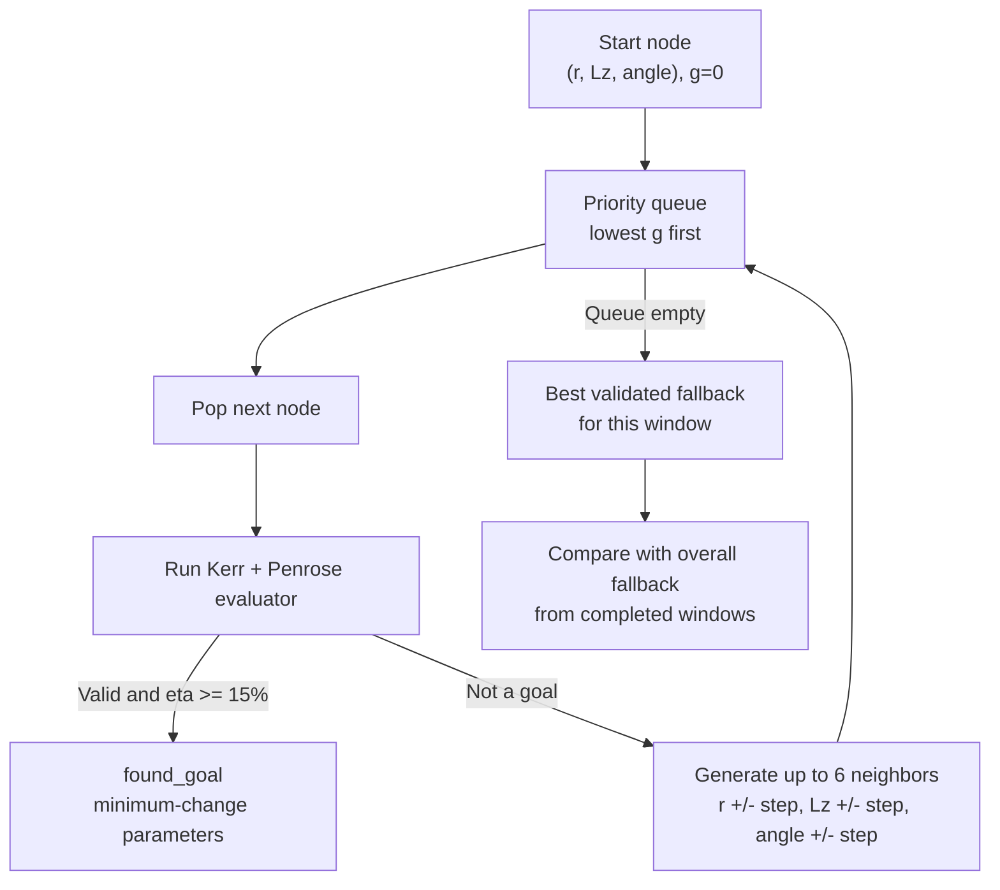

# Black Hole Energy Simulation

A deterministic C++20 engine for Kerr rotational-energy calculations,
equatorial geodesics, idealized Penrose-process validation, and bounded graph
search over particle-split parameters.

## What It Does

- Calculates total mass-energy, irreducible mass, and the theoretical Kerr
  rotational-energy reservoir, including mass/spin uncertainty ranges.
- Integrates equatorial Kerr trajectories with adaptive RK4 and radial-potential
  event detection.
- Models a local two-fragment Penrose split in a ZAMO frame while checking mass
  shells, four-momentum conservation, negative-energy capture, outward escape,
  and numerical residuals.
- Searches nodes `(split radius, Lz, split angle)` using deterministic Dijkstra.

The configured target is **15% net Penrose efficiency**:

```text
eta = (E_escape - E_input) / E_input
```

## Dijkstra Search

Each edge changes exactly one parameter by one configured step and costs one.
Therefore `h = 0`, `f = g`, and Dijkstra returns the qualifying parameters with
the fewest unit changes from the starting node.



`found_goal` means the selected parameters pass every engine requirement:
positive net extraction, efficiency of at least 15%, conservation and mass-shell
tolerances, horizon capture of the negative-energy fragment, and escape of the
positive-energy fragment.

## Bounded Windows

One scalar window may contain at most **2,700 nodes**. Split-radius bounds must
remain strictly between the outer horizon and equatorial ergosphere boundary.
CLI searches cannot use a node or time budget that could skip a declared grid
node.

If a completed window misses 15%, it returns its highest validated fallback.
The interactive session retains the best fallback across completed windows and
resets that history if the fixed physical scenario changes. The user can then
submit a new parameter window below or above a previous interval.

This guarantees coverage of configured grid points only. Smaller steps are
required to test values between them.

The public `95 x 5 x 5` search contains 2,375 nodes. Its current best validated
result is **9.065063%**, so it reports `best_feasible_below_target`, not
`found_goal`.

## Build And Run

```powershell
cmake -S . -B build -DCMAKE_BUILD_TYPE=Release
cmake --build build
ctest --test-dir build --output-on-failure
.\build\black_hole_demo.exe --interactive
.\build\black_hole_demo.exe --search-penrose .\scenarios\equatorial_penrose_dijkstra_15_percent.cfg
```

All **13 tests** currently pass.

## Scope

The current baseline is equatorial (`Q = 0`), neutral, idealized, and
single-threaded. Multithreading, SIMD, full Kerr motion, charged particles, and
validated MHD/GRMHD are future work. The toy-plasma calculation is not a GRMHD
simulation, and no energy-delivery feasibility is claimed.
