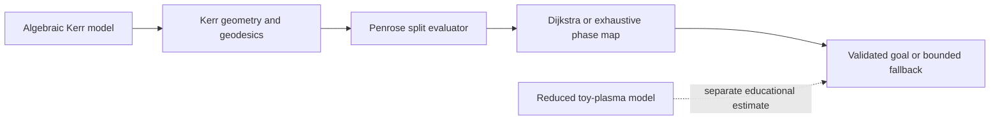
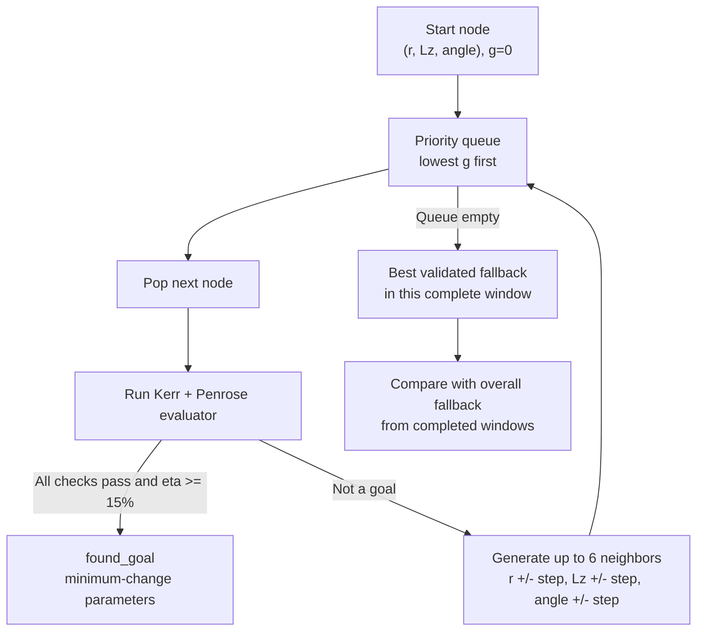

# Black Hole Energy Simulation

This project is a deterministic C++20 scientific-computing engine for studying
idealized energy extraction from rotating black holes. It combines algebraic
Kerr energy estimates, numerical geodesic integration, a locally
four-momentum-conserving Penrose split, and graph search over candidate split
parameters. The current implementation is a scalar, equatorial research
baseline. It calculates theoretical scenarios; it does not claim that energy
has been extracted from an observed black hole or can be delivered to Earth.

## Model Pipeline



### 1. Algebraic Kerr Energy Model

The algebraic model answers the first question: does the declared black hole
have rotational energy available in principle? Its inputs are SI mass `M` in
kilograms and dimensionless spin `a_star`, constrained by
`M > 0` and `0 <= a_star < 1`.

The irreducible-mass fraction and irreducible mass are

```text
f_irr = sqrt((1 + sqrt(1 - a_star^2)) / 2)
M_irr = M * f_irr
```

The total mass-energy, rotational fraction, and theoretical rotational-energy
reservoir are

```text
E_mass = M * c^2
f_rot  = 1 - f_irr
E_rot  = E_mass * f_rot = (M - M_irr) * c^2
```

`M_irr` is the mass that cannot be removed by ideal reversible spin extraction.
When spin is zero, `M_irr = M` and `E_rot = 0`. As spin approaches the
sub-extremal limit, the rotational fraction approaches about 29.29%. That is a
reservoir limit, not the efficiency of one Penrose event.

The model also reports local spin sensitivity:

```text
dE_rot/da_star = M*c^2*a_star /
                 (4*sqrt(1-a_star^2)*f_irr)
```

For uncertainty ranges, the engine evaluates ordered lower, central, and upper
mass/spin pairs and reports asymmetric differences around the central result.
All inputs and outputs are checked for finite values and overflow.

### 2. Schwarzschild Reference Model

The Schwarzschild solver is a nonrotating reference used to validate basic
trajectory integration. It models an equatorial timelike orbit using specific
energy `epsilon` and specific angular momentum `ell`. In geometrized units
`G = c = 1`, its radial potential is

```text
R_S(r) = epsilon^2 - (1 - 2M/r)*(1 + ell^2/r^2)
(dr/dtau)^2 = R_S(r)
```

`R_S > 0` permits radial motion, `R_S = 0` marks a turning boundary, and
`R_S < 0` is forbidden for that orbit. The remaining differential equations
are

```text
dphi/dtau = ell/r^2
dt/dtau   = epsilon/(1 - 2M/r)
d2r/dtau2 = -M/r^2 + ell^2/r^3 - 3M*ell^2/r^4
```

A fixed-step fourth-order Runge-Kutta method advances the state. Interpolation
places horizon-crossing and escape events on their configured boundaries. The
solver continuously measures the residual between radial velocity squared and
the radial potential, making it a useful correctness oracle before rotation
and frame dragging are introduced.

### 3. Equatorial Kerr Geodesic Model

The Kerr model determines whether incoming, captured, and escaping particle
paths are physically allowed around a rotating black hole. Internal values use
geometrized units. The dimensional spin length is `a = M*a_star`, and

```text
Delta = r^2 - 2Mr + a^2
r_plus  = M + sqrt(M^2 - a^2)
r_minus = M - sqrt(M^2 - a^2)
r_static(theta) = M + sqrt(M^2 - a^2*cos(theta)^2)
```

At the equator, `r_static = 2M`. The open region
`r_plus < r < 2M` is the equatorial ergosphere and is the permitted split
domain. The event horizon and ergosphere are separate boundaries: a captured
fragment must cross `r_plus`, while a split merely has to occur inside the
ergosphere and outside the horizon.

For conserved energy `E`, axial angular momentum `Lz`, rest mass `mu`, and
Carter constant `Q`, define

```text
P = E*(r^2 + a^2) - a*Lz
B = Lz - a*E
R_K(r) = P^2 - Delta*(mu^2*r^2 + B^2 + Q)
```

The current equatorial model requires `Q = 0`. With `Sigma = r^2`, the
contravariant momentum components are

```text
p^r   = direction*sqrt(R_K)/Sigma
p^t   = (a*B + (r^2+a^2)*P/Delta)/Sigma
p^phi = (B + a*P/Delta)/Sigma
```

The engine rejects past-directed states with `p^t <= 0`. As in the
Schwarzschild model, `R_K < 0` is forbidden and `R_K = 0` identifies a radial
turning point. The integrator samples for the first forbidden interval and
uses bisection to localize its boundary rather than allowing a numerical step
to jump across it.

Kerr trajectories use adaptive RK4:

```text
y_next = y + h*(k1 + 2k2 + 2k3 + k4)/6
```

One full step is compared with two half steps. The normalized local error is
divided by `2^4 - 1 = 15`; steps with error above one are rejected, and later
step sizes are adjusted with a safety factor. Boundary intersections are
localized through interpolation or repeated step bisection. Diagnostics record
accepted and rejected steps, final step size, maximum normalized error, and the
radial first-integral residual.

### 4. Penrose Split Model

The Penrose evaluator connects local vector mechanics to global Kerr
trajectories. It accepts one fixed scenario and three candidate parameters:
normalized split radius, normalized incoming `Lz`, and local split angle.

At the split radius it constructs the equatorial metric. With

```text
A = (r^2 + a^2)^2 - a^2*Delta
g_tt = -(1 - 2M/r)       g_tphi = -2Ma/r
g_phiphi = A/r^2         g_rr   = r^2/Delta
alpha = r*sqrt(Delta)/sqrt(A)
omega = 2Mar/A
```

`alpha` is the lapse and `omega` is the frame-dragging angular velocity. The
incoming coordinate momentum is transformed into a local zero-angular-momentum
observer, or ZAMO, frame:

```text
p_local^t   = alpha*p^t
p_local^r   = r*p^r/sqrt(Delta)
p_local^phi = sqrt(g_phiphi)*(p^phi - omega*p^t)
```

The local frame uses the Minkowski inner product
`u dot v = -u_t*v_t + u_r*v_r + u_phi*v_phi`. The parent four-velocity is
normalized, radial and azimuthal seed vectors are projected orthogonally to
it, and a Gram-Schmidt step creates an orthonormal split basis.

For the current equal-daughter model,

```text
E_daughter = m_parent/2
p_daughter = sqrt(E_daughter^2 - m_fragment^2)
n = cos(angle)*e_radial + sin(angle)*e_azimuthal
p_1 = E_daughter*u_parent + p_daughter*n
p_2 = E_daughter*u_parent - p_daughter*n
```

The opposite spatial terms guarantee local four-momentum conservation by
construction. The evaluator transforms both daughters back to Boyer-Lindquist
coordinates, calculates `E = -p_t` and `Lz = p_phi`, checks their mass shells,
reconstructs their Kerr momenta, and measures all residuals.

A feasible event requires one future-directed fragment with negative energy at
infinity and inward radial momentum, plus one positive-energy outward fragment.
The negative-energy trajectory must cross the horizon and the positive-energy
trajectory must reach the configured escape radius. Efficiency and net
extraction are

```text
eta_penrose = (E_escape - E_input)/E_input
E_extracted = max(0, E_escape - E_input)
```

The public baseline uses massless daughters. It is an idealized test-particle
calculation, not yet an atomic-nucleus, electromagnetic, radiation-reaction, or
plasma interaction model.

### 5. Dijkstra Search And Phase Map

Each search node is an integer grid key that maps to
`(split radius, Lz, split angle)`. Integer keys avoid duplicate states caused
by floating-point accumulation. A node has up to six neighbors because one
coordinate changes by one positive or negative step. Every edge currently has
cost one, so

```text
g = number of parameter steps from the start
h = 0
f = g + h = g
```



`std::priority_queue` selects the lowest `g`; ordered maps store best costs,
parents, discovery order, and compact evaluations. Stable key and discovery
ordering make ties deterministic. A `found_goal` tuple is not accepted merely
because its efficiency is high. It must be inside the search domain, pass the
Penrose evaluator, conserve momentum within tolerance, capture the intended
fragment, escape the other fragment, and satisfy `eta_penrose >= 0.15`.

One bounded window is limited to 25,000 nodes. CLI runs require enough evaluation
budget for every declared node and disable wall-clock termination. Therefore,
if no goal is found, the connected grid has been exhausted and the engine can
return its highest validated below-target fallback. The interactive session
compares these fallbacks across completed windows and resets the history when
the fixed physical scenario changes. This guarantee covers grid points only;
no finite grid proves that a qualifying continuous point between steps does not
exist.

The separate phase-map function evaluates every key in deterministic order and
reports the best validated extraction in that bounded grid. Dijkstra solves the
minimum-adjustment threshold problem; the phase map answers the different
question of which tested point has the greatest extraction.

The public `100 x 10 x 25` scenario contains exactly 25,000 nodes. Its current
best result is 11.78031%, so it returns `best_feasible_below_target` rather than
claiming a 15% goal.

### 6. Reduced Toy-Plasma Model

The plasma component is a transparent zero-dimensional scaling estimate. For
magnetic field `B`, mass density `rho`, flow area `A_flow`, and SI vacuum
permeability `mu_0`, it calculates

```text
sigma = B^2/(mu_0*rho*c^2)
v_A = c*sqrt(sigma/(1 + sigma))
P_raw = (B^2/mu_0)*v_A*A_flow
coupling = clamp(a_star^2*sigma/(1 + sigma), 0, 1)
P_out = P_raw*coupling
E_out = P_out*duration
```

The coupling is explicitly heuristic. This model does not solve conservation
laws on a grid, separate matter and Poynting fluxes, evolve magnetic geometry,
or qualify as MHD or GRMHD. It remains separate from the validated Penrose
energy ledger.

## Computational Geometry And Vector Math

This project primarily uses **differential geometry and numerical geometry**,
not classical computational-geometry structures such as polygon meshes,
convex hulls, or spatial trees. Its geometric computations still have clear
algorithmic roles.

The Kerr metric defines curved-spacetime distances and coordinate coupling.
The horizon and static limit are implicit geometric surfaces; in the
equatorial restriction they become radial boundaries. Trajectory steps are
tested for intersections with horizon, escape, target-radius, and turning-point
boundaries. Linear interpolation localizes simple crossings, while bisection
localizes Kerr turning points and adaptive RK4 event times.

The ZAMO calculation is vector math in a local orthonormal frame. It transforms
vectors between coordinate and local components, uses an indefinite Minkowski
dot product, projects spatial seeds orthogonally to the parent four-velocity,
normalizes the resulting basis, and constructs daughter momenta as linear
combinations. Vector addition proves local momentum balance, while metric
contraction checks the invariant mass shell. The parameter search adds a second
geometry: a discrete three-dimensional lattice whose axis-aligned adjacency
becomes the Dijkstra graph.

## Performance Engineering

Correct scalar execution remains the physics reference. The exhaustive phase
map now groups four adjacent split angles that share radius and incoming `Lz`,
prepares their incoming geodesic once, and evaluates their split, ZAMO,
conservation, reconstructed-momentum, adaptive fragment-integration, and energy
operations through four-lane kernels. Each integration lane retains independent
step control and termination state. Non-AVX2 builds execute the same batch
contract through portable scalar fallbacks; remainder nodes use the full scalar
event evaluator.

Several implemented choices already support reliable performance work:

- canonical integer keys eliminate repeated floating-point states;
- compact cached candidate records avoid retaining three full trajectories for
  every Dijkstra node;
- only the selected event is freshly recomputed and returned with complete
  trajectories;
- trajectory vectors reserve expected capacity;
- adaptive stepping rejects inaccurate work and increases the step in smooth
  regions;
- horizon, escape, and turning-point events terminate trajectories early;
- explicit diagnostics separate graph work from physics evaluations and make
  optimization regressions observable.

Graph bookkeeping costs approximately `O((V + E) log V)` with the binary heap
and ordered maps, but geodesic integration dominates runtime. Controlled
25,000-node exhaustive phase-map runs produced:

| Release backend | Elapsed | Throughput |
| --- | ---: | ---: |
| Historical node-at-a-time scalar | 656.839 s | 38.061 nodes/s |
| Portable scalar batch4 (`-O3`) | 202.058 s | 123.727 nodes/s |
| AVX2 batch4 (`-O3 -mavx2`) | 194.732 s | 128.382 nodes/s |

Against the matched portable batch backend, AVX2 delivered a measured 1.0376x
throughput ratio, 3.76% more nodes per second, and 3.63% lower runtime. The full
batching plus AVX2 change was 3.373x faster than the historical node-at-a-time
baseline, but most of that gain comes from shared-parent reuse rather than SIMD.
The graph dispatched 6,000 four-node batches covering 24,000 nodes and 1,000
scalar tail nodes; 5,592 batches reached AVX2 arithmetic, while 408 terminated
during incoming-geodesic preparation. All runs returned identical status counts,
selected parameters, efficiency, and residuals.

Measurements are single controlled runs on an Intel Core Ultra 7 258V using GCC
15.2.0, Release `-O3`, one application thread, and the same process priority.
They are reproducibility observations, not a benchmark distribution.

The next performance milestone is to retain one prepared incoming state across
an entire angle row instead of one four-node batch, then compact active fragment
lanes before integration. That will reduce repeated parent work and wasted SIMD
lanes when neighboring trajectories terminate at different times.

After profiling, independent phase-map tiles can be distributed across a fixed
`std::jthread` worker pool and merged by canonical key for deterministic output.
A structure-of-arrays batch would then store contiguous radii, energies,
angular momenta, and spins. SIMD is best applied to uniform arithmetic such as
`Delta`, radial-potential, metric, coordinate-transform, and residual
evaluation. Adaptive trajectories with different step counts should not be
forced into the same vector lanes without grouping or active-lane compaction.

Benchmarks must compare identical validated inputs in scalar-single-thread,
scalar-multithread, SIMD-single-thread, and SIMD-multithread modes. Required
measurements include throughput, median and tail latency, scaling efficiency,
vector ISA, compiler flags, cache misses, branch misses, and numerical
agreement with the scalar oracle. Only measured improvements that preserve
goal selection and residual tolerances should become performance claims.

## Build And Verify

```powershell
cmake -S . -B build -DCMAKE_BUILD_TYPE=Release
cmake --build build
ctest --test-dir build --output-on-failure
.\build\black_hole_demo.exe --interactive
.\build\black_hole_demo.exe --search-penrose .\scenarios\equatorial_penrose_dijkstra_15_percent.cfg

# Separate AVX2-enabled build on a compatible x86-64 CPU
cmake -S . -B build-avx2 -DCMAKE_BUILD_TYPE=Release -DBH_ENABLE_AVX2=ON
cmake --build build-avx2
```

All 13 current tests pass. They cover algebraic limits and uncertainty, radial
potentials, integration events and residuals, Penrose conservation and
capture/escape, deterministic search behavior, the 25,000-node contract,
cross-window fallback aggregation, CLI validation, and CMake package use.
