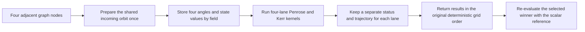

# Four-Lane SIMD Implementation Walkthrough

## What changed

The exhaustive Penrose phase map previously evaluated one parameter state at a
time. It now groups four adjacent states and evaluates them together through a
four-lane batch interface. On an AVX2-enabled x86-64 build, one 256-bit register
can hold four `double` values, so the same numerical instruction can operate on
all four candidates.

This optimization applies to the exhaustive `map` workflow. The
Dijkstra priority-queue search remains scalar because each node selected from
the queue determines which node is expanded next.

## The basic idea

The graph varies three parameters:

1. split radius;
2. incoming angular momentum;
3. split angle.

The angle is the innermost grid dimension. Four consecutive nodes therefore
have the same split radius and incoming angular momentum but different angles.
For example:

```text
lane 0: radius = 1.095, Lz = 2.07, angle = -2.00
lane 1: radius = 1.095, Lz = 2.07, angle = -1.99
lane 2: radius = 1.095, Lz = 2.07, angle = -1.98
lane 3: radius = 1.095, Lz = 2.07, angle = -1.97
```

A **lane** is one position in the four-value batch. The lanes are independent
candidate events; they are not four points on one particle trajectory.



## What happens for each batch

1. The phase-map loop collects four consecutive angle keys.
2. `evaluate_equatorial_penrose_angle_batch4` verifies that the four candidates
   share the scenario values required for batching.
3. The incoming parent geodesic is prepared once for the group because changing
   only the split angle does not change that incoming path.
4. Candidate values are arranged as four-value arrays. This is a small
   structure-of-arrays layout: angles are together, energies are together,
   radial values are together, and so on.
5. The batch evaluator performs the ZAMO coordinate transforms, fragment split,
   conservation checks, reconstructed momentum checks, and energy ledger for
   four candidates.
6. The captured and escaping fragments are passed to
   `integrate_kerr_batch4`. Its RK4 stages call the four-lane Kerr radial
   potential and four-momentum kernels.
7. Each integration lane keeps its own step size, rejected-step count,
   termination reason, and active/inactive state. One fragment may escape while
   another lane keeps integrating.
8. If fewer than four angle nodes remain, those tail nodes use the original
   scalar evaluator.

The numerical kernel is the small, repeated part of the physics computation.
Examples here are radial-potential evaluation, coordinate conversion, fragment
momentum arithmetic, conservation residuals, and Penrose energy calculation.

## Files changed

| File | Responsibility |
| --- | --- |
| `include/bh/kerr_geodesic.hpp` | Declares four-value Kerr batch types and `integrate_kerr_batch4`. |
| `src/integrators/kerr_geodesic.cpp` | Implements masked four-lane derivatives, RK4 stages, adaptive stepping, and event termination. |
| `include/bh/penrose_model.hpp` | Declares the compact event summary and public four-candidate Penrose evaluator. |
| `src/physics/penrose_model.cpp` | Implements the batched split, ZAMO transforms, residuals, fragment integration, and energy calculation. |
| `src/optimization/dijkstra.cpp` | Groups four adjacent angle states in the exhaustive phase map and preserves grid order. |
| `include/bh/dijkstra.hpp` | Stores batch, AVX2, and scalar-tail diagnostic counters. |
| `src/app/main.cpp` | Prints the selected backend and four-lane execution counts. |
| `tests/model_tests.cpp` | Compares batch results with the scalar reference and checks deterministic ordering. |

## Correctness protections

The scalar implementation remains the correctness oracle. The batch tests
compare the following values lane by lane:

- event status and capture/escape termination;
- input, captured, escaping, and extracted energy;
- Penrose efficiency;
- radial potential and four-momentum;
- conservation and mass-shell residuals;
- final radius and affine integration time.

The phase map also preserves canonical key order. Most importantly, the final
selected candidate is evaluated again with the complete scalar event function
before it is returned. Invalid batches and exceptional numerical cases fall
back to scalar evaluation rather than publishing an uncertain SIMD result.

## Measured result

The controlled 25,000-node run produced these single-run measurements on an
Intel Core Ultra 7 258V with GCC 15.2.0, Release `-O3`, and one application
thread:

| Backend | Runtime | Throughput |
| --- | ---: | ---: |
| Historical node-at-a-time scalar | 656.839 s | 38.061 nodes/s |
| Portable scalar batch4 | 202.058 s | 123.727 nodes/s |
| AVX2 batch4 | 194.732 s | 128.382 nodes/s |

The honest SIMD comparison is AVX2 batch4 against portable scalar batch4. AVX2
improved throughput by **3.76%** and reduced runtime by **3.63%**, a **1.0376x**
throughput ratio. The complete change is **3.373x** faster than the old
node-at-a-time implementation, but most of that larger gain comes from batching
and reusing the incoming parent computation, not from AVX2 alone.

The 25,000-node run used:

- 6,000 four-lane batches covering 24,000 nodes;
- 1,000 scalar tail nodes;
- 5,592 batches that reached AVX2 arithmetic;
- 408 batches that stopped during incoming-parent preparation.

All three runs returned the same status counts and the same best candidate:

```text
radius = 1.095
incoming Lz = 2.07
split angle = -1.88
Penrose efficiency = 11.78031%
maximum residual = 1.136868e-13
```

No node reached the configured 15% target in that bounded grid, so this is the
best validated fallback found, not a 15% goal result.

## Build and run it

Portable batch implementation:

```powershell
cmake -S . -B build-scalar -DCMAKE_BUILD_TYPE=Release -DBH_ENABLE_AVX2=OFF
cmake --build build-scalar
ctest --test-dir build-scalar --output-on-failure
.\build-scalar\black-hole-sim.exe map .\scenarios\equatorial_penrose_dijkstra_15_percent.cfg
```

AVX2 implementation on a compatible x86-64 processor:

```powershell
cmake -S . -B build-avx2 -DCMAKE_BUILD_TYPE=Release -DBH_ENABLE_AVX2=ON
cmake --build build-avx2
ctest --test-dir build-avx2 --output-on-failure
.\build-avx2\black-hole-sim.exe map .\scenarios\equatorial_penrose_dijkstra_15_percent.cfg
```

The CLI reports the backend, total four-lane batches, AVX2 batches, four-lane
nodes, and scalar tail nodes. Compare identical scenario files and Release
builds when measuring performance.

## Current limitations and next improvement

- AVX2 is an x86-64-specific backend; other builds use the portable batch path.
- Different adaptive trajectories finish at different times, leaving inactive
  SIMD lanes and reducing vector utilization.
- The shared incoming parent is currently reused for four angles, not for the
  entire angle row.
- The benchmark numbers above are controlled observations from one run, not a
  median over repeated trials.

The next useful optimization is to prepare the incoming state once for a full
radius-and-angular-momentum row, then feed its angles through consecutive
four-lane fragment batches. After that, compacting active integration lanes can
reduce wasted SIMD work when trajectories diverge.

## Short explanation for an interview

> I converted the exhaustive Penrose parameter scan from node-at-a-time
> evaluation to deterministic four-candidate batches, reused their common
> incoming orbit, and added AVX2 kernels with per-lane adaptive Kerr integration
> and scalar verification. AVX2 increased throughput by 3.76% over the matched
> portable batch implementation, while batching plus shared computation produced
> a 3.373x gain over the original scalar workflow.
